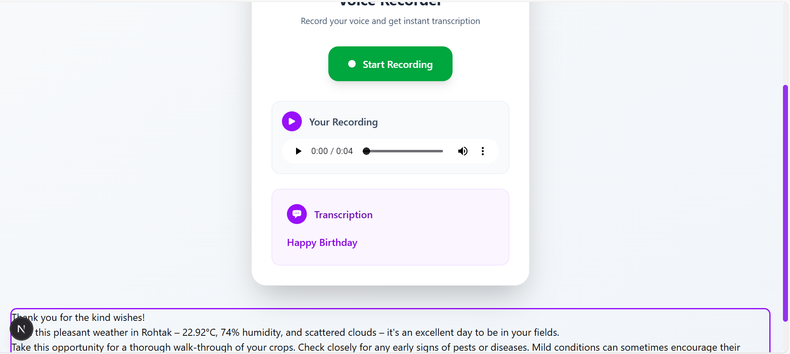

# 🌾 AI-Powered Farmer Advisory System

An intelligent **AI-based farmer support platform** that provides real-time crop insights, multilingual responses, and personalized recommendations.  
Built with cutting-edge open-source tools and models.

---

## 🧠 Tech Stack

- **Fullstack framework:** Next.js  
- **Backend:** FastAPI  
- **Database:** MongoDB  
- **AI / ML:** Whisper, Keras, Gemini (Google Generative AI)  
- **Data:** Kaggle datasets  
- **Storage:** Cloudinary  
- **Maps:** OpenStreetMap  
- **Weather API:** OpenWeatherMap  

---

## 🚀 Features

- 🌐 **Multilingual Interface** — supports multiple Indian and global languages.  
- 🗺️ **Location-Based LLM Output** — answers adapt to your location and weather.  
- 🧠 **Crop Disease Detection** — using a custom fine-tuned Keras CNN model.  
- 🗣️ **Audio, Text, and Image Inputs** — ask queries in any format.  
- 💬 **LLM Response Flexibility** — choose output in text, image, or audio form.  
- 🔒 **User Authentication** — secure and private access.  
- 🌾 **AI-Driven Farmer Advisory** — provides crop care, fertilizer, and weather insights.  
- 📢 **Feedback System** — users can give and view advisory feedback.  
- 🧍 **Safe and Reliable** — ensures factual and trustworthy information.  

## 🌍 APIs & Integrations

| Integration | Purpose | Description |
|--------------|----------|-------------|
| **OpenWeatherMap API** | Real-time weather data | Used to provide location-based crop and climate information for better advisory suggestions. |
| **OpenStreetMap** | Geolocation & Mapping | Helps identify user location and link farm data to regional weather and soil patterns. |
| **Cloudinary** | Image & Video Storage | Securely stores and serves user-uploaded images (crop pictures, voice query files, etc.). |
| **Google Gemini API** | Generative AI Responses | Powers natural language and multilingual responses for farmer queries. |
| **Kaggle Dataset Integration** | Crop Disease Training Data | Source dataset used for fine-tuning the Keras CNN model for crop disease detection. |
| **Whisper (OpenAI)** | Speech-to-Text Conversion | Converts farmers’ audio queries to text for processing by the LLM. |
| **MongoDB Atlas** | Database Storage | Stores user queries, history, feedback, and advisory responses. |

---
📸 Demo Section

 
🖼️ <b>Click Here for demo pictures</b>

  
  
  
  
  
  
  

